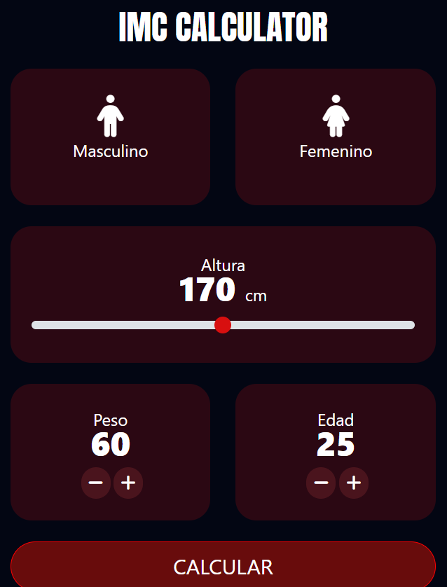

<h1 align="center"> Habits </h1>

Projeto feito para a diciplina de eletiva Web da Fatec ITU  

  <a href="#-tecnologias">Tecnologias</a>&nbsp;&nbsp;&nbsp;|&nbsp;&nbsp;&nbsp;
  <a href="#-projeto">Projeto</a>&nbsp;&nbsp;&nbsp;|&nbsp;&nbsp;&nbsp;
  <a href="#memo-licença">Licença</a>

  

 

  

## 🚀 Tecnologias

Esse projeto foi desenvolvido com as seguintes tecnologias:

- Angular
- Typescript
- Git e Github
- NodeJS

## 💻 Projeto

Pagina criada como evolução do projeto de IMC-Calculadora, utilizando toda uma página para fazer a calculadora.

## ⚜️ Licença

Esse projeto está sob a licença MIT.

---

Feito com ❤️ by Rocketseat👋